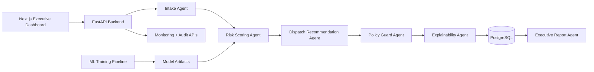

# FIELDOPS SENTINEL AI

**An agentic operations intelligence platform for field service teams.**

FIELDOPS Sentinel AI helps dispatch centers, telecom operators, utilities teams, and maintenance operations run field service execution with proactive risk intelligence and auditable decision support.

## Why This Project Matters
Field service organizations lose margin and SLA reliability because operational decisions are slow, manual, and not traceable.

This platform addresses:
- poor prioritization of service orders
- high no-show and rescheduling rates
- regional under/over-allocation of technicians
- limited explainability of AI recommendations
- no audit trail for high-impact decisions

## Product Capabilities
- ingest and normalize service orders/schedules
- predict delay, no-show, SLA-breach and rescheduling risk
- recommend dispatch prioritization and redistribution
- explain decisions in business language and operations language
- enforce policy guardrails before critical actions
- require human approval for high-impact actions
- expose executive and model monitoring dashboards

## System Architecture



## Multi-Agent Flow
1. **Intake Agent**: validates required fields, normalizes and classifies order.
2. **Risk Scoring Agent**: predicts delay/no-show/reschedule risks from tabular model.
3. **Dispatch Recommendation Agent**: proposes priority, window and technician/region fallback.
4. **Policy Guard Agent**: blocks skill mismatch and flags critical SLA conditions.
5. **Explainability Agent**: creates executive and operational reasoning.
6. **Executive Report Agent**: aggregates bottlenecks, risk hotspots, and load alerts.

## Tech Stack
### Frontend
- Next.js 15
- TypeScript
- Tailwind CSS
- shadcn/ui-style component structure (`components.json` + `src/components/ui`)
- Recharts
- Framer Motion

### Backend
- FastAPI
- Pydantic
- SQLAlchemy
- PostgreSQL
- JWT auth (manager / dispatcher / analyst)

### AI / Analytics
- pandas, numpy
- scikit-learn pipelines
- XGBoost classifiers (delay, no-show, reschedule)
- synthetic data generation and training scripts

### Infra / Quality
- Docker Compose
- Makefile
- `.env.example`
- GitHub Actions (lint + test + build)

## Repository Structure
```text
/frontend
/backend
/ml
/scripts
/docs
/docker
/.github/workflows
```

## Screenshots (Placeholders)
- `docs/screenshots/login.png`
- `docs/screenshots/command-center.png`
- `docs/screenshots/orders.png`
- `docs/screenshots/recommendations-queue.png`
- `docs/screenshots/model-monitoring.png`

## Local Setup
1. Copy env file:
   - `cp .env.example .env`
2. Start services:
   - `docker compose up --build`
3. Frontend:
   - `http://localhost:3000`
4. Backend docs:
   - `http://localhost:8000/docs`

### Demo Credentials
- manager: `manager@fieldops.ai` / `manager123`
- dispatcher: `dispatcher@fieldops.ai` / `dispatcher123`
- analyst: `analyst@fieldops.ai` / `analyst123`

## Data & Model Workflow
### Generate synthetic dataset
- `python ml/scripts/generate_synthetic_data.py --rows 5000`

### Train models
- `python ml/scripts/train_models.py`

### Seed demo data through API
- `python scripts/seed_demo_data.py --rows 120`

### Included demo artifacts
- sample synthetic data: `ml/data/demo_orders_sample.csv`
- baseline metrics snapshot: `ml/reports/model_metrics_baseline.json`

## Dashboard Modules
- **Login Screen** with role-based demo access
- **Command Center** with KPIs, risk by region, pending approvals
- **Orders Page** with searchable operational table
- **Order Detail** with order context + recommendation status
- **Recommendations Queue** with approve/reject + justification
- **Executive Insights** with bottlenecks and regional risk
- **Model Monitoring** with latency, drift simulation, score distribution, override rate

## Business Metrics Exposed
- percent of orders at risk
- average SLA risk score
- approval rate
- override rate
- average response latency
- projected avoided delays
- projected backlog reduction
- estimated operational impact

## Observability
- structured JSON logs
- `x-request-id` correlation on every request
- `decision_id` tracking for recommendation lifecycle
- `audit_logs` table with actor, action, payload, timestamp
- model monitoring endpoint with latency, drift simulation and overrides

## Governance & Human-In-The-Loop
- high-impact recommendations default to `pending_human_approval`
- explicit approve/reject action with human justification
- capture of approver identity and timestamp
- AI recommendation vs final human outcome persisted for audit

## Security Notes
- no hardcoded production secrets
- env-driven configuration (`.env.example`)
- strong Pydantic input validation
- JWT access control
- CORS configured
- basic in-memory rate limiting
- full audit trail for critical decisions

## Endpoint Documentation
See: [docs/endpoints.md](docs/endpoints.md)

## Production Considerations
- replace in-memory rate limiter with Redis-backed limiter
- add alembic migrations and secret manager integration
- add model registry/versioning and shadow deployments
- implement background queues for high-throughput ingestion
- integrate real geospatial routing engine

## Roadmap
- real route optimization
- real-time streaming events
- LLM-powered incident reasoning
- multi-tenant SaaS mode
- geospatial optimization
- online learning
- external integrations (ERP/CRM/workforce systems)

## Future Improvements
- richer policy engine with configurable rules DSL
- uncertainty calibration and confidence intervals
- cost-to-serve optimization layer
- scenario simulator for dispatch tradeoff planning
- A/B testing of recommendation strategies

---
FIELDOPS Sentinel AI is built to demonstrate practical AI operations architecture with explainability, governance, and measurable business impact.
