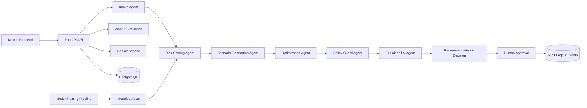

# FIELDOPS SENTINEL AI

**Operational Loss Prevention Engine for Field Service**

FIELDOPS Sentinel AI is an **agentic operations intelligence platform for field service teams**. It predicts operational failure risk, estimates economic exposure, simulates recovery options, recommends the lowest-cost feasible intervention under constraints, enforces human approval for critical actions, and stores a complete audit trail.

## Why This Project Exists
Field operations teams in telecom, utilities, maintenance, and dispatch centers lose revenue through preventable operational failures:
- failed truck rolls
- SLA breaches
- avoidable reschedules
- poor regional balancing
- low decision traceability

This project demonstrates a practical, locally runnable architecture for reducing those losses.

## Product Thesis
This is not a chatbot wrapper.

The platform combines:
- predictive risk scoring (delay, no-show, reschedule, SLA breach)
- constrained scenario generation
- optimization-guided intervention selection
- policy guardrails
- human-in-the-loop approval
- replayable and auditable decision lifecycle

## Architecture Overview
- **Frontend**: Next.js 15 + TypeScript + Tailwind + Recharts + Framer Motion
- **Backend**: FastAPI + Pydantic v2 + SQLAlchemy 2 + PostgreSQL + JWT auth
- **ML**: synthetic data generation + tabular model training (XGBoost fallback path documented)
- **Optimization**: OR-Tools CP-SAT when available with deterministic heuristic fallback
- **Observability**: structured logging, request correlation, decision_id traceability, metrics endpoint, audit logs



## Core Workflows
1. Order ingestion and normalization
2. Risk scoring and factor extraction
3. Scenario generation with economic impact estimation
4. Feasible scenario optimization
5. Policy enforcement and approval gating
6. Recommendation publication and human decision capture
7. Audit and replay timeline persistence

## Tech Stack
### Frontend
- Next.js 15 (App Router)
- TypeScript
- Tailwind CSS
- Recharts
- Framer Motion

### Backend
- Python 3.12
- FastAPI
- Pydantic v2
- SQLAlchemy 2.x
- PostgreSQL
- JWT + Passlib bcrypt

### AI / Optimization
- pandas
- numpy
- scikit-learn
- xgboost
- OR-Tools CP-SAT (fallback supported)

### Infra / Tooling
- Docker Compose
- Makefile
- GitHub Actions
- Ruff + pytest
- ESLint + Prettier

## Local Setup
1. Copy environment file:
   - `cp .env.example .env`
2. Build and run:
   - `docker compose up --build`
3. Access:
   - Frontend: `http://localhost:3000/login`
   - API docs: `http://localhost:8000/docs`
   - Health: `http://localhost:8000/health`
   - Metrics: `http://localhost:8000/metrics`

## Environment Variables
See `.env.example`.

Key variables:
- `DATABASE_URL` (optional full override)
- `POSTGRES_*`
- `SECRET_KEY`
- `JWT_EXPIRE_MINUTES`
- `CORS_ORIGINS`
- `MODEL_DELAY_PATH`, `MODEL_NOSHOW_PATH`, `MODEL_RESCHEDULE_PATH`, `MODEL_SLA_PATH`

## Demo Credentials
- `manager@fieldops.ai / manager123`
- `dispatcher@fieldops.ai / dispatcher123`
- `analyst@fieldops.ai / analyst123`

## Data Generation and Model Training
Generate synthetic data:
- `python ml/scripts/generate_synthetic_data.py --rows 5000`

Train risk models:
- `python ml/scripts/train_models.py`

Output artifacts include:
- model `.pkl` files
- `ml/models/feature_columns.json`
- `ml/reports/model_metrics.json`
- `ml/reports/feature_importance.json`
- `ml/artifacts/registry.json`

## Risk Scoring and Optimization Logic
The system scores:
- delay risk
- no-show risk
- reschedule risk
- SLA breach risk

Consolidated risk uses weighted fusion and deterministic feature contribution summaries.

Scenarios are generated per order, filtered by feasibility, then selected via CP-SAT (or deterministic fallback) to maximize projected net operational benefit.

## Economic Impact Model
Each scenario estimates:
- cost of inaction
- cost of intervention
- projected SLA penalty avoided
- repeat-visit loss avoided
- no-show loss avoided
- projected total operational loss avoided

Full formula details: `docs/economic-impact.md`.

## Human-in-the-Loop Approval Flow
Critical recommendations are kept in `pending_human_approval`.

Authorized users can approve or reject with justification. The platform records:
- decision actor
- timestamp
- recommendation status transition
- override feedback category
- audit log record

## Observability and Auditability
Implemented today:
- request_id middleware
- decision_id lifecycle tracking
- structured logging hooks
- audit logs for critical actions
- `/metrics` endpoint for internal counters/gauges
- order event timeline for replay

## API Overview
Main domains:
- Auth
- Orders
- Risk
- Recommendations
- Approvals
- Simulations
- Dashboard/Insights
- Replay
- System endpoints

Detailed API contract: `docs/api.md`.

## Screens and UX Overview
Implemented routes:
- `/login`
- `/dashboard`
- `/orders`
- `/orders/[id]`
- `/recommendations`
- `/insights`
- `/monitoring`
- `/replay/[id]`

## Project Structure
```text
/frontend
/backend
/ml
/scripts
/docs
/docker
/.github/workflows
```

## Testing
Backend tests cover:
- auth
- orders listing
- risk scoring flow
- recommendation flow
- approve/reject
- simulation endpoint
- replay endpoint

Run:
- `make test`

## Production Considerations
- add Alembic migrations for schema evolution
- move rate-limiting state to distributed storage
- harden metrics/telemetry exporters
- add model/version rollout and shadow evaluation
- split async orchestration for high-volume workloads

## Known Limitations
Documented in `docs/assumptions.md`.

## Future Improvements
- real route optimization with richer constraints
- event streaming for real-time operations
- online learning loops from override feedback
- multi-tenant SaaS boundaries
- external WFM/ERP integrations
- richer replay outcome attribution
