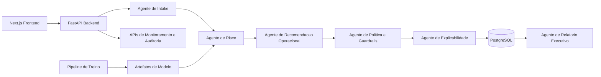

# FIELDOPS SENTINEL AI

**Plataforma agentic de inteligência operacional para operações de campo em ambiente real.**

Este projeto foi construído para demonstrar um produto de IA aplicado a operações críticas, com arquitetura robusta, governança humana, explicabilidade e visão executiva.

## Posicionamento
O FIELDOPS Sentinel AI apoia operações de:
- telecomunicações;
- utilities;
- manutenção técnica;
- centros de despacho;
- gestores operacionais.

## Problemas Reais que o Sistema Resolve
- ordens mal priorizadas;
- risco elevado de atraso, no-show e reagendamento;
- quebra de SLA por decisão tardia;
- desequilíbrio de carga entre técnicos e regiões;
- falta de explicabilidade da recomendação da IA;
- ausência de auditoria em decisões críticas.

## Diferenciais de Nível Enterprise
- pipeline multiagente funcional (não chatbot);
- recomendação operacional com policy guard;
- fluxo Humano no Loop obrigatório para ações críticas;
- trilha auditável por `request_id` e `decision_id`;
- dashboard executivo premium para operação e liderança;
- seed automático com dados realistas para prova de valor imediata.

## Arquitetura Geral



## Fluxo Multiagente
1. **Agente de Intake**
   - normaliza dados de ordem;
   - valida campos obrigatórios;
   - classifica contexto da ordem.

2. **Agente de Risco**
   - calcula risco de atraso;
   - calcula risco de no-show;
   - calcula risco de reagendamento;
   - devolve score consolidado e fatores.

3. **Agente de Recomendacao Operacional**
   - sugere prioridade e janela operacional;
   - propõe redistribuição técnico/região;
   - combina heurística operacional com score de risco.

4. **Agente de Politica e Guardrails**
   - bloqueia sugestões sem skill compatível;
   - sinaliza risco de SLA crítico;
   - impõe aprovação humana para alto impacto.

5. **Agente de Explicabilidade**
   - gera explicação executiva;
   - gera explicação operacional;
   - facilita auditoria e confiança.

6. **Agente de Relatorio Executivo**
   - consolida gargalos;
   - identifica regiões de maior risco;
   - aponta pressão de backlog.

## Humano no Loop
- recomendações críticas ficam em `pending_human_approval`;
- operador decide aprovar/rejeitar;
- justificativa humana é registrada;
- decisão final é rastreada e auditada.

## Stack Técnica
### Frontend
- Next.js 15
- TypeScript
- Tailwind CSS
- estrutura `shadcn/ui`
- Recharts
- Framer Motion

### Backend
- FastAPI
- Pydantic
- SQLAlchemy
- PostgreSQL
- JWT

### IA / Analytics
- pandas
- numpy
- scikit-learn
- XGBoost

### Infra e Qualidade
- Docker Compose
- Makefile
- `.env.example`
- GitHub Actions (lint + teste + build)

## Estrutura do Repositório
```text
/frontend
/backend
/ml
/scripts
/docs
/docker
/.github/workflows
```

## Execução Local
1. Copie variáveis de ambiente:
   - `cp .env.example .env`
2. Suba os serviços:
   - `docker compose up -d --build`
3. Acesse:
   - Frontend: `http://localhost:3000/login`
   - Swagger: `http://localhost:8000/docs`

## Credenciais de Demonstração
- `manager@fieldops.ai / manager123`
- `dispatcher@fieldops.ai / dispatcher123`
- `analyst@fieldops.ai / analyst123`

## Prova de Valor com Dados Reais
Quando o banco inicia vazio, o sistema realiza auto-seed com cenário operacional completo.

Exemplo real validado:
- `orders`: 180
- `recommendations`: 180
- `decisions`: 180
- com aprovações e rejeições humanas registradas

Endpoint para validação:
- `GET /api/v1/dashboard/demo-status`

## Pipeline de Dados e Treino
### Gerar dataset sintético
- `python ml/scripts/generate_synthetic_data.py --rows 5000`

### Treinar modelos
- `python ml/scripts/train_models.py`

### Alimentar ordens via API
- `python scripts/seed_demo_data.py --rows 120`

## Módulos do Produto
- **Login Operacional**
- **Centro de Comando**
- **Grade de Ordens**
- **Detalhe de Caso com IA**
- **Fila de Recomendações Críticas**
- **Insights Executivos**
- **Monitoramento de Modelo**

## Métricas de Negócio Expostas
- percentual de ordens em risco;
- risco médio de SLA;
- taxa de aprovação humana;
- taxa de override humano;
- latência média de resposta;
- atrasos evitados projetados;
- redução de backlog projetada;
- impacto operacional estimado.

## Observabilidade e Governança
- logs estruturados;
- correlação por `request_id`;
- rastreio por `decision_id`;
- auditoria em `audit_logs`;
- monitoramento de latência e drift;
- política de aprovação humana para ações críticas.

## Segurança
- configuração por ambiente;
- validação forte de entrada;
- CORS;
- JWT;
- rate limiting básico;
- sem segredos de produção no código.

## Documentação Complementar
- Endpoints: `docs/endpoints.md`
- Arquitetura: `docs/architecture.md`

## Considerações de Produção
- migrações com Alembic;
- rate limit distribuído com Redis;
- OpenTelemetry + Prometheus + Grafana;
- filas assíncronas para alta escala;
- versionamento e rollout controlado de modelos.

## Roadmap
- otimização geoespacial real de rotas;
- ingestão de eventos em tempo real;
- reasoning com LLM para incidentes complexos;
- modo multi-tenant SaaS;
- online learning;
- integrações ERP/CRM/WFM.

## Resumo
Este projeto representa um blueprint realista de IA aplicada a operações: produto com apresentação premium, arquitetura sólida e governança adequada para contexto corporativo.