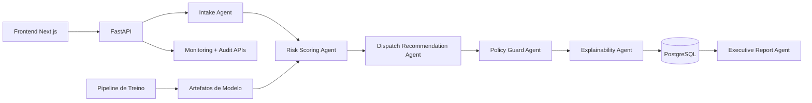

# FIELDOPS SENTINEL AI

**Uma plataforma agentic de inteligência operacional para equipes de campo.**

O FIELDOPS Sentinel AI foi desenvolvido para resolver problemas reais de operação de campo com IA aplicada, governança humana e rastreabilidade completa.

## Proposta de Valor
Em operações de telecom, utilities, manutenção e assistência técnica, é comum ocorrer:
- priorização ruim de ordens;
- alto volume de reagendamentos;
- risco de atraso e quebra de SLA;
- decisões lentas e sem explicabilidade;
- ausência de trilha de auditoria para recomendações da IA.

A plataforma ataca esses pontos com uma arquitetura multiagente, visão executiva e fluxo Human-in-the-Loop.

## O Que Torna Este Projeto Diferente
- arquitetura multiagente funcional (não chatbot genérico);
- previsão de risco operacional com modelos tabulares (delay, no-show, reschedule);
- recomendações de dispatch com policy guard;
- ações críticas obrigatoriamente validadas por humanos;
- auditoria por `request_id` e `decision_id`;
- dashboard premium para operação e gestão executiva;
- dataset demo realista carregado automaticamente.

## Arquitetura



## Agentes de IA
1. **Intake Agent**: recebe e normaliza ordens de serviço.
2. **Risk Scoring Agent**: estima risco de atraso, no-show e reagendamento.
3. **Dispatch Recommendation Agent**: sugere priorização e redistribuição.
4. **Policy Guard Agent**: bloqueia violações de regra de negócio.
5. **Explainability Agent**: traduz racional técnico para linguagem de negócio.
6. **Executive Report Agent**: consolida gargalos e riscos agregados.

## Human-in-the-Loop
- recomendações críticas entram como `pending_human_approval`;
- aprovador/revisor adiciona justificativa;
- decisão humana fica vinculada ao `decision_id`;
- comparação IA vs decisão final é persistida para auditoria.

## Stack Técnica
### Frontend
- Next.js 15
- TypeScript
- Tailwind CSS
- estrutura `shadcn/ui`
- Recharts
- Framer Motion

### Backend
- FastAPI
- Pydantic
- SQLAlchemy
- PostgreSQL
- JWT (manager / dispatcher / analyst)

### IA / Analytics
- pandas
- numpy
- scikit-learn
- XGBoost

### Infra / Qualidade
- Docker Compose
- Makefile
- `.env.example`
- GitHub Actions (lint + test + build)

## Estrutura
```text
/frontend
/backend
/ml
/scripts
/docs
/docker
/.github/workflows
```

## Como Rodar
1. Copie o env:
   - `cp .env.example .env`
2. Suba os serviços:
   - `docker compose up -d --build`
3. Acesse:
   - Frontend: `http://localhost:3000/login`
   - API docs: `http://localhost:8000/docs`

## Credenciais de Demo
- `manager@fieldops.ai / manager123`
- `dispatcher@fieldops.ai / dispatcher123`
- `analyst@fieldops.ai / analyst123`

## Dados Reais de Demonstração (Auto-Seed)
Quando o banco está vazio, o backend gera automaticamente cenário operacional completo.

Exemplo real validado:
- `orders`: 180
- `recommendations`: 180
- `decisions`: 180
- `pending_human_approval`: 37+
- com aprovações e rejeições humanas registradas

Endpoint de validação:
- `GET /api/v1/dashboard/demo-status`

## Pipeline de Dados e Treino
### Gerar dataset sintético
- `python ml/scripts/generate_synthetic_data.py --rows 5000`

### Treinar modelos
- `python ml/scripts/train_models.py`

### Inserir ordens via API
- `python scripts/seed_demo_data.py --rows 120`

## Módulos do Produto
- **Login** com perfis operacionais
- **Centro de Comando** com KPIs, risco regional e fila HITL
- **Ordens** com grade avançada e abertura de caso
- **Detalhe da Ordem** com narrativa de decisão
- **Fila de Recomendações** com aprovar/rejeitar + justificativa
- **Insights Executivos** para liderança
- **Monitoramento de Modelo** com latência, drift e override

## Métricas de Negócio Expostas
- percentual de ordens em risco
- score médio de risco de SLA
- taxa de aprovação humana
- taxa de override
- latência média de resposta
- atrasos evitados projetados
- redução de backlog projetada
- impacto operacional estimado

## Observabilidade e Governança
- logs estruturados
- correlação por `request_id`
- trilha por `decision_id`
- histórico em `audit_logs`
- monitoramento de latência e override
- políticas de ação crítica com aprovação humana

## Segurança
- configuração via ambiente (`.env.example`)
- validação forte de entrada (Pydantic)
- CORS configurado
- autenticação JWT
- rate limiting básico
- sem segredo hardcoded para produção

## Endpoints
Veja documentação em: `docs/endpoints.md`

## Considerações de Produção
- migrar para Alembic
- rate limiting distribuído (Redis)
- observabilidade com OpenTelemetry/Prometheus
- filas assíncronas para alta vazão
- versionamento de modelos e rollout controlado

## Roadmap
- otimização real de rotas geoespaciais
- eventos em tempo real (streaming)
- reasoning com LLM para incidentes complexos
- modo multi-tenant SaaS
- online learning e feedback loops
- integrações externas (ERP/CRM/WFM)

## Por Que Este Projeto Importa
Este projeto demonstra capacidade de entregar uma solução de IA aplicada ao mundo real com:
- arquitetura robusta;
- produto visualmente maduro;
- governança e explicabilidade;
- foco em impacto operacional mensurável.